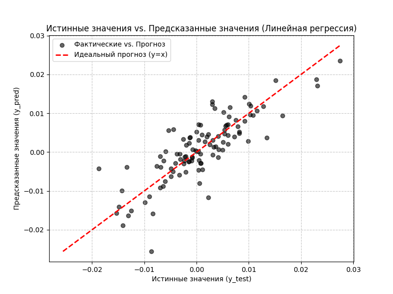
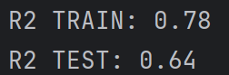
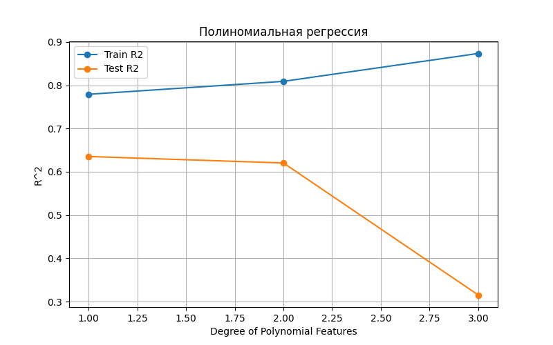
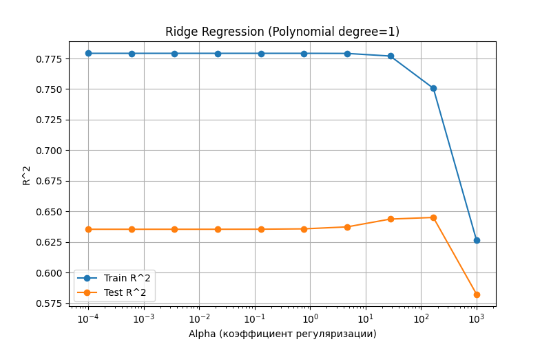
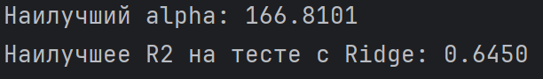

# Лабораторная работа 3. Линейная регрессия. Вариант №15
## Задание
Работа ведется в с датасетом "ISTANBUL STOCK EXCHANGE"

1. Написать программу, которая разделяет исходную выборку на обучающую и тестовую (training set, test set). Использовать стандартные функции (train_test_split и др. нельзя).
2. С использованием библиотеки scikit-learn обучить модель линейной регрессии по обучающей выборке
3. Проверить точность модели по тестовой выборке
4. Построить модель с использованием полиномиальной функции. Построить графики зависимости точности на обучающей и тестовой выборке от степени полиномиальной функции.
5. Построить модель с использованием регуляризации. На основе экспериментов подобрать параметры для регуляризации. Построить графики зависимости точности модели на обучающей и тестовой выборках от коэффициента регуляризации.


## 1) Разделение на тестовую и обучающую выборки
В документации sklearn под тестовую выборку выделяется 20% данных. В программе поступим следующим образом: найдем общее количество данных и создадим массив индексов, после перемешаем индексы случайным образом и разделим их из расчета 80% train, 20% test. Так же дополнительно выведем количество данных в обеих выборках
```
# =========
# 1) Разделение на тестовую и обучающую выборки
# =========

# Общее количество данных
n_samples = x.shape[0]

# Массив индексов от 0 до n_samples-1
indices = np.arange(n_samples)

# Перемешиваем индексы случайным образом
np.random.shuffle(indices)

# Применяем перемешанные индексы к x и y (DataFrame/Series)
x_shuffled = x.iloc[indices]
y_shuffled = y.iloc[indices]

# Разделяем перемешанные данные из расчета 80% train, 20% test
train_size = int(n_samples * 0.8)

x_train = x_shuffled[:train_size]
x_test = x_shuffled[train_size:]

y_train = y_shuffled[:train_size]
y_test = y_shuffled[train_size:]

print(f"Размер обучающей выборки: {x_train.shape}")
print(f"Размер тестовой выборки: {x_test.shape}")

```


## 2) Обучение модели линейной регрессии
Линейная регрессия - статистический метод моделирования зависимости между независимыми переменными (признаками) и зависимой переменной (целевой величиной).

С использованием библиотеки scikit-learn обучить модель линейной регрессии по обучающей выборке. Создаем объект класса LinearRegression и запускаем алгоритм градиентного спуска. После выполнения алгоритма пытаемся предсказать значения.

```
# =========
# 2) Обучение модели линейной регрессии
# =========

# Создаем объект класса LinearRegression и запускаем алгоритм градиентного спуска
regressor = LinearRegression().fit(x_train, y_train)

# Предсказания
y_train_pred = regressor.predict(x_train)
y_test_pred = regressor.predict(x_test)
```

Получаем следующий результам:
<p align="center">
  
</p>


## 3) Проверка модели на тестовой выборке
Проверка точности - это процесс оценки способности модели делать правильные предсказания на новых, ранее не виденных данных. Для оценки качества модели используются метрики. Они помогают понять, насколько хорошо модель справляется с задачей предсказания. Мы можем использовать две основные метрики: MSE и R². MSE (среднеквадратичная ошибка) измеряет абсолютное среднее отклонение предсказаний от реальных значений. Она удобна для сравнения моделей, работающих с одними единицами измерения, но ее значение сильно зависит от масштаба данных и чувствительно к выбросам. R² (коэффициент детерминации) – это нормированная метрика, показывающая, какую долю изменчивости целевой переменной модель смогла объяснить. R² всегда находится в диапазоне от минус бесконечности до 1, где 1 означает идеальное предсказание. Благодаря своей нормированности, R² позволяет сравнивать модели независимо от масштаба данных, что делает его универсальным инструментом оценки.

Остановимся на использовании метрики R2. Для оценки модели по выбранной метрике будем использовать стандартную функцию r2_score.
R² показывает:
1.0 - идеальное предсказание
0.0 - модель не лучше среднего значения
< 0 - модель хуже простого среднего

```
# =========
# 3) Проверка модели на тестовой выборке
# =========

print(f"Коэффициэнт детерминации TRAIN: {r2_score(y_train, y_train_pred):.2f}")
print(f"Коэффициэнт детерминации TEST: {r2_score(y_test, y_test_pred):.2f}")
```

Получаем уследующие значения как для обучающей, так и для тестовой выборки. Модель обучена.
<p align="center">
  
</p>


## 4.Построить модель с использованием полиномиальной функции
Создаём pipeline - объект, который автоматизирует процесс трансформации признаков в полиномиальные. Он будет применять шаги poly_features и linear_regression по порядку. Иначе нам пришлось бы вручную использовать методы

Полиномиальная регрессия — это метод машинного обучения, используемый для моделирования нелинейных зависимостей между переменными путем аппроксимации данных полиномом степени (k). В отличие от линейной регрессии, которая предполагает прямую связь, этот метод позволяет учитывать более сложные криволинейные тренды в данных, что делает его полезным в различных областях, таких как экономика и инженерия.
```
from sklearn.pipeline import Pipeline
from sklearn.preprocessing import PolynomialFeatures

degree = 2
alphas = np.logspace(-4, 3, 10)  # диапазон коэффициентов регуляризации

r2_train_list = []
r2_test_list = []

for alpha in alphas:
    pipeline = Pipeline([
        ("poly", PolynomialFeatures(degree=degree, include_bias=False)),
        ("scaler", StandardScaler()),
        ("ridge", Ridge(alpha=alpha, max_iter=10000))
    ])

    # Обучаем модель на train
    pipeline.fit(X_train, y_train)

    # Предсказания
    y_train_pred = pipeline.predict(X_train)
    y_test_pred = pipeline.predict(X_test)

    # R^2
    r2_train_list.append(r2_score(y_train, y_train_pred))
    r2_test_list.append(r2_score(y_test, y_test_pred))

plt.figure(figsize=(8, 5))
plt.semilogx(alphas, r2_train_list, marker='o', label="Train R^2")
plt.semilogx(alphas, r2_test_list, marker='o', label="Test R^2")
plt.xlabel("Alpha (коэффициент регуляризации)")
plt.ylabel("R^2")
plt.title(f"Ridge Regression (Polynomial degree={degree})")
plt.ylim(0, 1)
plt.grid(True)
plt.legend()
plt.show()
```
На графике мы наблюдаем переобучение (overfitting) модели.


## 5. Построить модель с использованием регуляризации
Ridge-регрессия (или гребневая регрессия) — это регуляризованная версия линейной регрессии, которая используется для борьбы с мультиколлинеарностью (линейной зависимостью между предикторами) и переобучением. Она добавляет к функции потерь штрафное слагаемое в виде квадрата коэффициентов, чтобы сделать веса модели меньше, но не обнулить их, в отличие от Lasso-регрессии.

Алгоритм обучения пытается найти баланс между подгонкой под данные и поддержанием коэффициентов на низком уровне.
```
degree = 2
alphas = np.logspace(-4, 3, 10)  # диапазон коэффициентов регуляризации

r2_train_list = []
r2_test_list = []

for alpha in alphas:
    pipeline = Pipeline([
        ("poly", PolynomialFeatures(degree=degree, include_bias=False)),
        ("scaler", StandardScaler()),
        ("ridge", Ridge(alpha=alpha, max_iter=10000))
    ])

    # Обучаем модель на train
    pipeline.fit(X_train, y_train)

    # Предсказания
    y_train_pred = pipeline.predict(X_train)
    y_test_pred = pipeline.predict(X_test)

    # R^2
    r2_train_list.append(r2_score(y_train, y_train_pred))
    r2_test_list.append(r2_score(y_test, y_test_pred))

plt.figure(figsize=(8, 5))
plt.semilogx(alphas, r2_train_list, marker='o', label="Train R^2")
plt.semilogx(alphas, r2_test_list, marker='o', label="Test R^2")
plt.xlabel("Alpha (коэффициент регуляризации)")
plt.ylabel("R^2")
plt.title(f"Ridge Regression (Polynomial degree={degree})")
plt.ylim(0, 1)
plt.grid(True)
plt.legend()
plt.show()

best_index = np.argmax(r2_test_list)
best_alpha = alphas[best_index]

print(f"Наилучший alpha: {best_alpha:.4f}")
```
Для борьбы с переобучением и коррелированными признаками применим регуляризацию Ridge (L2). Она добавляет штраф к сумме квадратов коэффициентов модели, что стабилизирует обучение и уменьшает влияние сильно коррелированных признаков.

Почему я использовал Ridge? 
1. Полиномиальные признаки сильно коррелированы между собой
2. Ridge лучше справляется с мультиколлинеарностью
3. Сохраняет все признаки

В качестве признаков используем полиномиальные признаки 3-й степени, как в предыдущем пункте (средняя точность и меньше затрат в вычислительной мощности). Обновим наш pipeline, который теперь выполняет следующие шаги:

PolynomialFeatures(degree=3, include_bias=False) – создаёт новые признаки, учитывающие комбинации и степени всех признаков (параметров смеси).

StandardScaler() – нормализует признаки. Это важно, так как L2-регуляризация чувствительна к масштабу признаков.

Ridge(alpha=α, max_iter=10000) – линейная регрессия с L2-регуляризацией. Параметр α контролирует силу штрафа: чем выше α, тем сильнее регуляризация и меньше риск переобучения.

Для подбора оптимального значения α выбираем диапазон от 10⁻⁴ до 10³ в логарифмической шкале.На графике можно увидеть, при каком αlpha модель лучше всего балансирует между переобучением и недообучением. Оптимальное значение α соответствует максимальному R² на тестовой выборке.




<p align="center">
  
</p>
