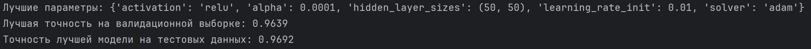
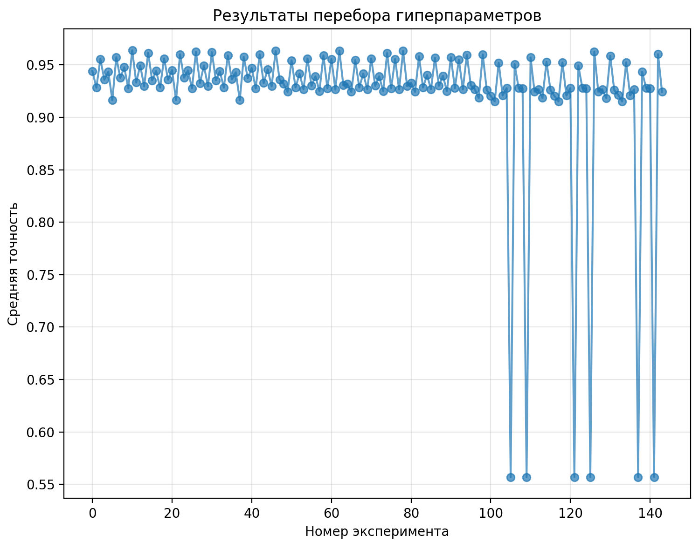
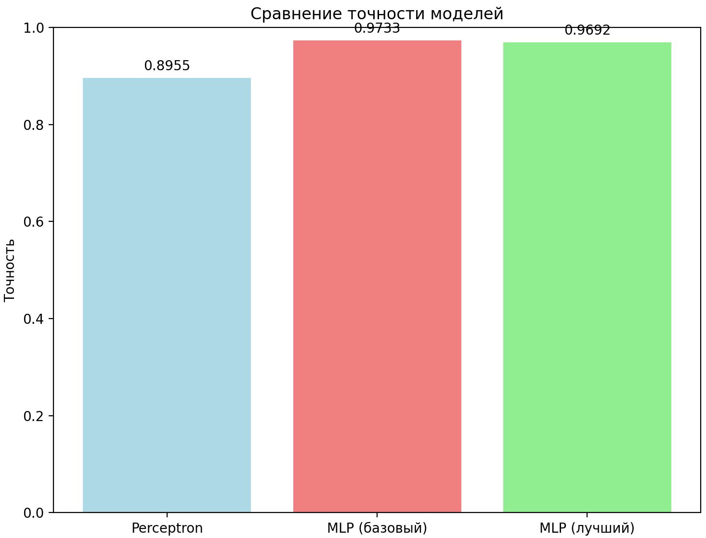

# Лабораторная работа 4. Основы нейронных сетей. Вариант №15
## Задание
Работа ведется в с датасетом "Phishing Websites"

1. Написать программу, которая разделяет исходную выборку на обучающую и тестовую (training set, test set).
2. Произвести масштабирование признаков (scaling).
3. С использованием библиотеки scikit-learn обучить 2 модели нейронной сети (Perceptron и MLPClassifier) по обучающей выборке. Перед обучением необходимо осуществить масштабирование признаков.
4. Проверить точность модели по тестовой выборке.
5. Провести эксперименты и определить наилучшие параметры коэффициента обучения, параметра регуляризации, функции оптимизации. Данные экспериментов необходимо представить в отчете (графики, ход проведения эксперимента, выводы).


## 1) Разделение на тестовую и обучающую выборки
В документации sklearn под тестовую выборку выделяется 20% данных. В программе используем стандартную функцию train_test_split.

```
# =========
# 1) Разделение на тестовую и обучающую выборки
# =========
X_train, X_test, y_train, y_test = train_test_split(
    X, y, test_size=0.2, random_state=42, stratify=y
)
```


## 2) Масштабирование признаков
Масштабирование признаков — это процесс приведения всех числовых признаков к одинаковому масштабу. В данном коде используется стандартизация - один из самых популярных методов масштабирования.


scaler = StandardScaler() — Создание объекта StandardScaler

X_train_scaled = scaler.fit_transform(X_train) — Обучение scaler на тренировочных данных и преобразование тренировочных данных

X_test_scaled = scaler.transform(X_test) — Преобразование тестовых данных с использованием параметров, полученных на тренировочных данных

```
# =========
# 2) Масштабирование признаков
# =========
scaler = StandardScaler()
X_train_scaled = scaler.fit_transform(X_train)
X_test_scaled = scaler.transform(X_test)
```


## 3) Обучение Perceptron и MLPClassifier
Perceptron (Однослойный перцептрон) — модель, имеющая только входной и выходной слои, без скрытых слоев

MLPClassifier (Многослойный перцептрон) — модель, имеющая только входной, выходной и скрытые слои

```
# =========
# 3) Обучение Perceptron и MLPClassifier
# =========
print("Обучение Perceptron...")
perceptron = Perceptron(max_iter=1000, random_state=42)
perceptron.fit(X_train_scaled, y_train)
y_pred_perceptron = perceptron.predict(X_test_scaled)
accuracy_perceptron = accuracy_score(y_test, y_pred_perceptron)

# MLPClassifier с базовыми параметрами
print("Обучение MLPClassifier...")
mlp = MLPClassifier(max_iter=1000, random_state=42)
mlp.fit(X_train_scaled, y_train)
y_pred_mlp = mlp.predict(X_test_scaled)
accuracy_mlp = accuracy_score(y_test, y_pred_mlp)

print(f"Точность Perceptron: {accuracy_perceptron:.4f}")
print(f"Точность MLPClassifier: {accuracy_mlp:.4f}")
print("\n" + "="*100 + "\n")
```


## 4) Проверка точности моделей
Для расчета точности используем метрику accuracy_score из библиотеки scikit-learn.
```
# =========
# 4) Проверка точности моделей
# =========
print(f"Точность Perceptron: {accuracy_perceptron:.4f}")
print(f"Точность MLPClassifier: {accuracy_mlp:.4f}")
```

Получаем следующие результаты:
<p align="center">
  
</p>


## 5) Подбор гиперпараметров
Гиперпараметры нейронной сети — это настраиваемые параметры, которые задаются до начала обучения и управляют самим процессом обучения и структурой модели. В работе мы изменяем:

Архитектуру сети (количество и размер скрытых слоев)

Тип функции активации (Rectified Linear Unit = f(x) = max(0, x); Hyperbolic Tangent = f(x) = tanh(x) = (e^x - e^(-x)) / (e^x + e^(-x));  Logistic = f(x) = 1 / (1 + e^(-x)))

Алгоритм оптимизации весов модели (Adaptive Moment Estimation, который имеет адаптивную скорость обучения для каждого параметра; Stochastic Gradient Descent, который 
Обновляет веса после каждого батча)

Коэффициент регуляризации

Начальную скорость обучения

```
# =========
# 5) Подбор гиперпараметров
# =========
print("Запуск GridSearchCV для подбора гиперпараметров...")
param_grid = {
    'hidden_layer_sizes': [(50,), (100,), (50, 50), (100, 50)],
    'activation': ['relu', 'tanh', 'logistic'],
    'solver': ['adam', 'sgd'],
    'alpha': [0.0001, 0.001, 0.01],
    'learning_rate_init': [0.001, 0.01]
}

grid_search = GridSearchCV(MLPClassifier(max_iter=1000, random_state=42, early_stopping=True),
                           param_grid,
                           scoring='accuracy',
                           cv=5,
                           n_jobs=-1,
                           verbose=1)

grid_search.fit(X_train_scaled, y_train)

print("\nЛучшие параметры:", grid_search.best_params_)
print("Лучшая точность на валидационной выборке: {:.4f}".format(grid_search.best_score_))

# Оценка лучшей модели на тестовых данных
best_mlp = grid_search.best_estimator_
y_pred_best = best_mlp.predict(X_test_scaled)
accuracy_best = accuracy_score(y_test, y_pred_best)
print(f"Точность лучшей модели на тестовых данных: {accuracy_best:.4f}")
```

Путем перебора различных комбинаций получаем следующие наилучшие значения:
<p align="center">
  
</p>
<p align="center">
  
</p>

Так же было проведено сравнение точности трех моделей. По графикам мы видим, что более сложная архитектура дает более хорошие результаты
<p align="center">
  
</p>
