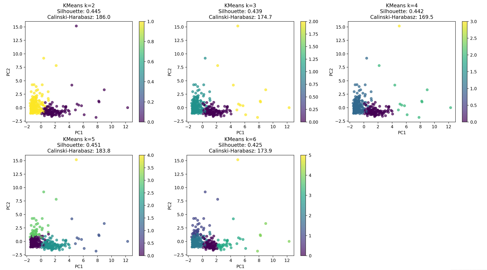
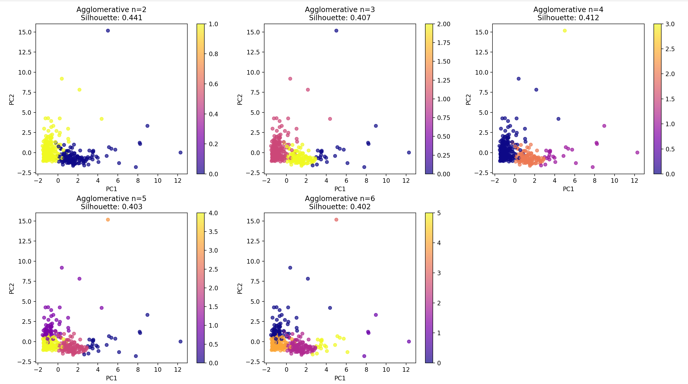
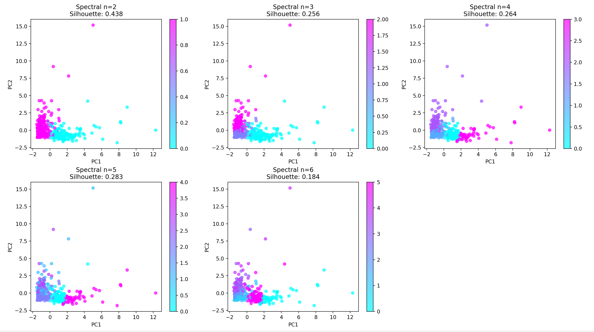
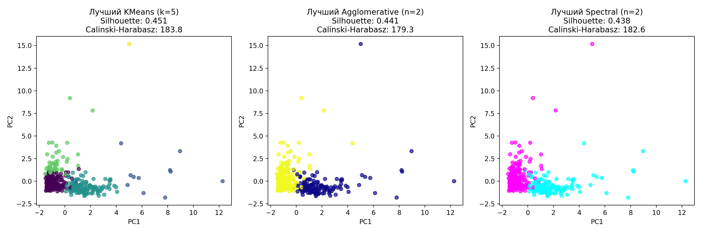
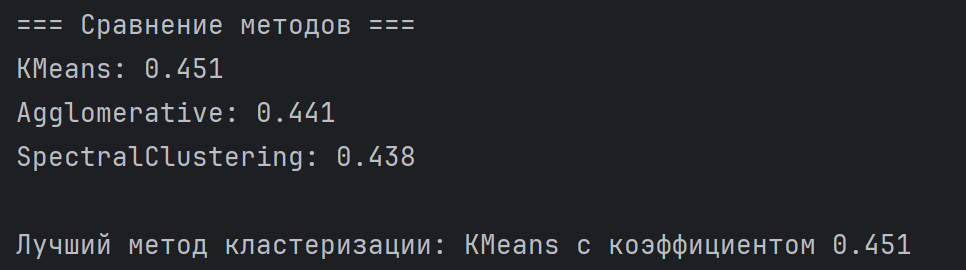

# Лабораторная работа 5. Алгоритмы кластеризации данных. Вариант №15
## Задание
Работа ведется в с датасетом "Wholesale customers"

1. Произвести масштабирование признаков (scaling).
2. С использованием библиотеки scikit-learn написать программу с использованием алгоритмов кластеризации данных, позволяющую разделить исходную выборку на классы.
3. Провести эксперименты и определить наилучший алгоритм кластеризации, параметры алгоритма. Данные экспериментов необходимо представить в отчете (графики, ход проведения эксперимента, выводы).


## 1) Масштабирование признаков
Масштабирование признаков — это процесс приведения всех числовых признаков к одинаковому масштабу. В данном коде используется стандартизация - один из самых популярных методов масштабирования.


scaler = StandardScaler() — Создание объекта StandardScaler

X_scaled = scaler.fit_transform(X) — Преобразование тестовых данных

pca = PCA(n_components=2) — Создание объекта PCA (Principal Component Analysis)

X_pca = pca.fit_transform(X_scaled) — Вычисление главных компонент и проецирование исходных многомерных данных на новые 2D-координаты

```
# =========
# 1) Масштабирование признаков
# =========
scaler = StandardScaler()
X_scaled = scaler.fit_transform(X)

pca = PCA(n_components=2)
X_pca = pca.fit_transform(X_scaled)
```


## 2) Опыты с алгоритмами кластеризации
Кластеризация —

В качестве методов кластеризации были выбраны: 

KMeans — 

Agglomerative Clustering —

Spectral Clustering — 

```
# =========
# 2) Опыты с алгоритмами кластеризации
# =========

# Функция для оценки кластеризации
def evaluate_clustering(model, data):
    labels = model.fit_predict(data)
    if len(set(labels)) > 1:
        score = silhouette_score(data, labels)
    else:
        score = -1
    return labels, score

# 2.1 KMeans
kmeans_params = [2, 3, 4, 5, 6]
best_score_kmeans = -1
best_kmeans = None
best_labels_kmeans = None
best_k = None
labels_for_k = []

print("=== KMeans Clustering ===")
for k in kmeans_params:
    kmeans = KMeans(n_clusters=k, random_state=42, n_init=10)
    labels, score = evaluate_clustering(kmeans, X_scaled)
    print(f'KMeans с k={k}, Силуэтный коэффициент: {score:.3f}')
    labels_for_k.append(labels)
    if score > best_score_kmeans:
        best_score_kmeans = score
        best_kmeans = kmeans
        best_labels_kmeans = labels
        best_k = k

print(f'Лучшее число кластеров для KMeans: {best_k} с коэффициентом: {best_score_kmeans:.3f}')

# Визуализация KMeans для каждого k
fig, axes = plt.subplots(2, 3, figsize=(15, 10))
axes = axes.ravel()
for i, k in enumerate(kmeans_params):
    labels = labels_for_k[i]
    scatter = axes[i].scatter(X_pca[:, 0], X_pca[:, 1], c=labels, cmap='viridis', s=30, alpha=0.7)
    axes[i].set_title(f'KMeans k={k}\nSilhouette: {silhouette_score(X_scaled, labels):.3f}')
    axes[i].set_xlabel('PC1')
    axes[i].set_ylabel('PC2')
    plt.colorbar(scatter, ax=axes[i])

# Скрываем последний subplot если нужно
if len(kmeans_params) < 6:
    axes[-1].set_visible(False)

plt.tight_layout()
plt.show()

# 2.2 Agglomerative Clustering
agg_params = [2, 3, 4, 5, 6]
best_score_agg = -1
best_labels_agg = []
best_n_agg = None
labels_list_agg = []

print("\n=== Agglomerative Clustering ===")
for n in agg_params:
    agg = AgglomerativeClustering(n_clusters=n)
    labels, score = evaluate_clustering(agg, X_scaled)
    print(f'Agglomerative с n_clusters={n}, Силуэтный коэффициент: {score:.3f}')
    labels_list_agg.append(labels)
    if score > best_score_agg:
        best_score_agg = score
        best_labels_agg = labels
        best_n_agg = n

print(f'Лучшее число кластеров для Agglomerative: {best_n_agg} с коэффициентом: {best_score_agg:.3f}')

# Визуализация Agglomerative для каждого n
fig, axes = plt.subplots(2, 3, figsize=(15, 10))
axes = axes.ravel()
for i, n in enumerate(agg_params):
    labels = labels_list_agg[i]
    scatter = axes[i].scatter(X_pca[:, 0], X_pca[:, 1], c=labels, cmap='plasma', s=30, alpha=0.7)
    axes[i].set_title(f'Agglomerative n={n}\nSilhouette: {silhouette_score(X_scaled, labels):.3f}')
    axes[i].set_xlabel('PC1')
    axes[i].set_ylabel('PC2')
    plt.colorbar(scatter, ax=axes[i])

if len(agg_params) < 6:
    axes[-1].set_visible(False)

plt.tight_layout()
plt.show()

# 2.3 Spectral Clustering
spectral_params = [2, 3, 4, 5, 6]
best_score_spectral = -1
best_labels_spectral = []
best_n_spectral = None
labels_list_spectral = []

print("\n=== Spectral Clustering ===")
for n in spectral_params:
    spectral = SpectralClustering(n_clusters=n, affinity='nearest_neighbors', random_state=42)
    labels, score = evaluate_clustering(spectral, X_scaled)
    print(f'SpectralClustering с n_clusters={n}, Силуэтный коэффициент: {score:.3f}')
    labels_list_spectral.append(labels)
    if score > best_score_spectral:
        best_score_spectral = score
        best_labels_spectral = labels
        best_n_spectral = n

print(f'Лучшее число кластеров для SpectralClustering: {best_n_spectral} с коэффициентом: {best_score_spectral:.3f}')

# Визуализация Spectral для каждого n
fig, axes = plt.subplots(2, 3, figsize=(15, 10))
axes = axes.ravel()
for i, n in enumerate(spectral_params):
    labels = labels_list_spectral[i]
    scatter = axes[i].scatter(X_pca[:, 0], X_pca[:, 1], c=labels, cmap='cool', s=30, alpha=0.7)
    axes[i].set_title(f'Spectral n={n}\nSilhouette: {silhouette_score(X_scaled, labels):.3f}')
    axes[i].set_xlabel('PC1')
    axes[i].set_ylabel('PC2')
    plt.colorbar(scatter, ax=axes[i])

if len(spectral_params) < 6:
    axes[-1].set_visible(False)

plt.tight_layout()
plt.show()
```

Для KMeans получаем следующие результаты:
<p align="center">
  
</p>

Для Agglomerative Clustering получаем следующие результаты:
<p align="center">
  
</p>

Для Spectral Clustering получаем следующие результаты:
<p align="center">
  
</p>

Сравнив результаты, мы можем сделать следующие выводы:
<p align="center">
  
</p>

<p align="center">
  
</p>
