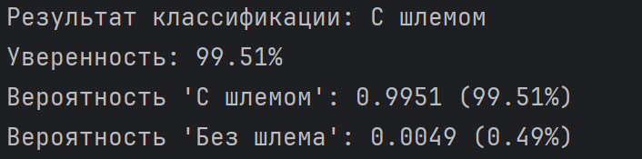
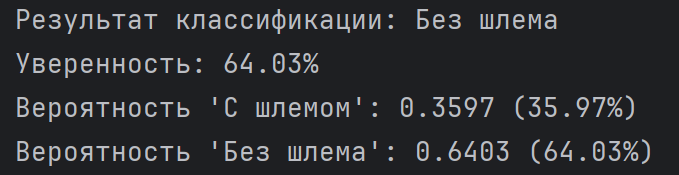

# TODO: ПЕРЕДЕЛАЙ РИДМИШКУ 
# Лабораторная работа №6. Сверточные сети
## Задание
Работа ведется в с датасетом "Helmet detection", который был взят с сайта kagglehub

1. С использованием библиотеки Keras загрузить обучающую выборку, создать модель сверточной сети, обучить ее на обучающей выборке, сохранить модель в файл.
2. Написать дополнительно программу, которая загружает модель из файла, и предоставляет возможность загрузить файл или данные любым иным способом, чтобы проверить точность классификатора.


## 1) Создание модели
Свёртная нейронная сеть (CNN,  Convolutional Neural Network) — это специализированный тип нейросетей глубокого обучения, оптимизированный для обработки данных с сеточной структурой, таких как изображения, видео и аудио. Они работают следующим образом: фильтр скользит по входному изображению, вычисляя скалярное произведение между своими весами и соответствующими участками изображения. Каждый фильтр ищет определённую особенность: одни — горизонтальные линии, другие — углы или части объектов. Результат работы фильтра на каждом участке изображения — карта признаков.

Архитектура CNN:

Сверточный слой — выделяет локальные особенности входного изображения

Слой подвыборки (пулинг) — уменьшает размерность данных и помогает оставить только самые значимые признаки

Полносвязный слой — строит итоговую модель на основе найденных признаков, отвечает за классификацию или принятие решения

```
import os
import numpy as np
import tensorflow as tf
from tensorflow.keras import layers
from PIL import Image
import xml.etree.ElementTree as ET
from sklearn.model_selection import train_test_split
import kagglehub


def parse_xml_annotation(xml_path):
    tree = ET.parse(xml_path)
    root = tree.getroot()

    classes = []
    for obj in root.findall('object'):
        class_name = obj.find('name').text.strip().lower()
        classes.append(class_name)

    has_without_helmet = any('without' in cls for cls in classes)
    has_with_helmet = any('with' in cls and 'without' not in cls for cls in classes)

    if has_without_helmet:
        return 1  # Без шлема
    elif has_with_helmet:
        return 0  # С шлемом
    else:
        return None


def load_dataset(dataset_path, img_size=(150, 150), max_samples=2000):
    images = []
    labels = []

    images_dir = os.path.join(dataset_path, "images")
    annotations_dir = os.path.join(dataset_path, "annotations")

    image_files = [f for f in os.listdir(images_dir)
                   if f.lower().endswith(('.png', '.jpg', '.jpeg'))]

    for i, img_file in enumerate(image_files[:max_samples]):
        xml_file = os.path.splitext(img_file)[0] + ".xml"
        xml_path = os.path.join(annotations_dir, xml_file)

        if not os.path.exists(xml_path):
            continue

        label = parse_xml_annotation(xml_path)
        if label is None:
            continue

        img_path = os.path.join(images_dir, img_file)
        try:
            img = Image.open(img_path).convert('RGB')
            img = img.resize(img_size)
            images.append(np.array(img))
            labels.append(label)
        except Exception as e:
            continue

    return np.array(images), np.array(labels)


def main():
    path = kagglehub.dataset_download("andrewmvd/helmet-detection")

    images, labels = load_dataset(path, img_size=(150, 150), max_samples=2000)

    train_images, test_images, train_labels, test_labels = train_test_split(
        images, labels, test_size=0.2, random_state=42
    )

    train_images = train_images.astype('float32') / 255.0
    test_images = test_images.astype('float32') / 255.0

    model = tf.keras.Sequential([
        layers.Conv2D(32, (3, 3), activation='relu', input_shape=(150, 150, 3)),
        layers.MaxPooling2D((2, 2)),

        layers.Conv2D(64, (3, 3), activation='relu'),
        layers.MaxPooling2D((2, 2)),

        layers.Conv2D(128, (3, 3), activation='relu'),
        layers.MaxPooling2D((2, 2)),

        layers.Flatten(),
        layers.Dense(128, activation='relu'),
        layers.Dropout(0.5),

        layers.Dense(1, activation='sigmoid')
    ])

    model.compile(
        optimizer='adam',
        loss='binary_crossentropy',
        metrics=['accuracy']
    )

    model.fit(
        train_images, train_labels,
        epochs=10,
        batch_size=32,
        validation_split=0.2,
        verbose=1
    )

    test_loss, test_acc = model.evaluate(test_images, test_labels, verbose=0)
    print(f"\nТочность на тестовой выборке: {test_acc:.4f}")

    model.save('helmet_detection_model.h5')


if __name__ == '__main__':
    main()
```


## 2) Проверка модели
Для проверки точности обученной модели в неё можно загрузить собственную картинку, чтобы модель выдала свое предсказание. Для этого входная картинка преобразуется в RGB формат и изменяется до размера 150x150 пикселей. После этого вызывается сохраненная модель, в которую передается изображение. В качестве метрики оценки используется число с плавающей точкой от 0 до 1 где:

0 — класс "С шлемом"

1 — класс "Без шлема"

```
import numpy as np
from PIL import Image
from tensorflow.keras.models import load_model


def preprocess_image(image_path, img_size=(150, 150)):
    img = Image.open(image_path).convert('RGB')
    img = img.resize(img_size)
    img_array = np.array(img).astype('float32') / 255.0
    img_array = np.expand_dims(img_array, axis=0)
    return img_array


def main():
    model = load_model('helmet_detection_model.h5')

    image_path = input("Введите путь к изображению: ")

    img_array = preprocess_image(image_path, img_size=(150, 150))

    prediction = model.predict(img_array, verbose=0)

    probability_no_helmet = prediction[0][0]
    probability_with_helmet = 1 - probability_no_helmet

    if probability_no_helmet > 0.5:
        predicted_class = "Без шлема"
        confidence = probability_no_helmet
    else:
        predicted_class = "С шлемом"
        confidence = probability_with_helmet

    print(f"Результат классификации: {predicted_class}")
    print(f"Уверенность: {confidence:.2%}")
    print(f"Вероятность 'С шлемом': {probability_with_helmet:.4f} ({probability_with_helmet:.2%})")
    print(f"Вероятность 'Без шлема': {probability_no_helmet:.4f} ({probability_no_helmet:.2%})")


if __name__ == '__main__':
    main()
```

Проверим точность модели на произвольных фотографиях:
<p align="center">
  
</p>

<p align="center">
  
</p>

============================================================================================

<p align="center">
  
</p>

<p align="center">
  
</p>
